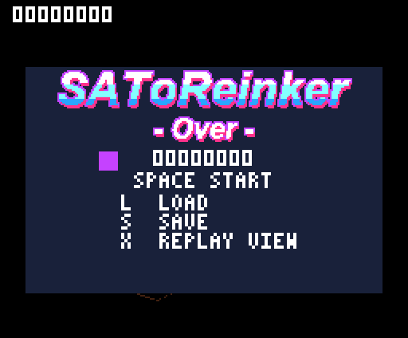
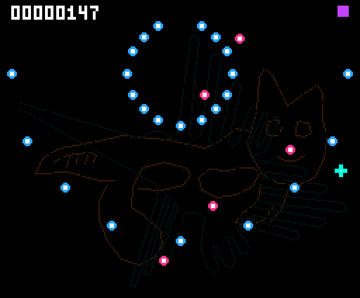
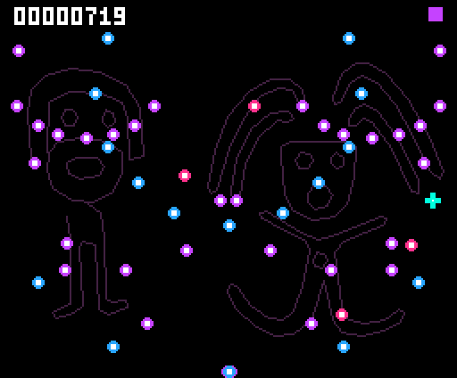
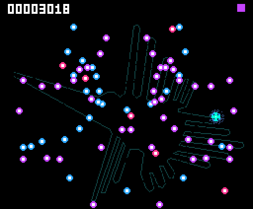

# SAToReinker-Over

## 初代MSX版 — 弾幕表現チャレンジ / MSX1 challenge

**[MSX版の紹介・ダウンロード / MSX1 page and downloads](msx1/README.md)**

初代MSXのPCGで色鮮やかな弾幕をどこまで動かせるか試す、SAToReinker-Overの実験版を追加しました。
**RAM32KiB・VRAM16KiB・512KiB ASCII8 ROM、リプレイなし。** ６種類の弾幕、かすり加点、PSGサウンドを搭載しています。
専用ページにROM、ソース、Windows起動セット、WAVE 2・WAVE 4の実ROM GIFを掲載しています。実機は未検証・無保証です。

A playable **MSX1 PCG bullet-pattern rendering challenge**: 32 KiB RAM, 16 KiB VRAM, a 512 KiB ASCII8 ROM and no replay.
Six patterns, graze scoring and PSG sound. The dedicated page includes the ROM, full source archive, Windows launcher bundle
and native emulator GIFs of WAVE 2 and WAVE 4. Experimental, no warranty, and not tested on physical hardware.

## turbo R + V9990版 / turbo R + V9990 version

以下はV9990版の説明です。MSX版は上記の専用ページをご覧ください。
The following documentation covers the V9990 version; see the page above for the separate MSX1 version.

MSX turbo R + V9990用の弾幕避けゲーム。**開発中の試作版です。正式完成版ではありません。**
A work-in-progress bullet-dodging game for **MSX turbo R + V9990**, in a **512 KiB ASCII8 MegaROM**.

## ダウンロード / Downloads

- [Windows試遊セット / Windows playtest ZIP](SAToReinker-Over-playtest.zip)
- [ROM: SAToReinker-Over.rom](SAToReinker-Over.rom)
- [MSX-MUSICリズムBGM試聴 / Rhythm BGM WAV](fm-rhythm.wav)

ZIPを展開してSTART.cmdを実行してください。openMSXは別途必要です。既定位置は `C:\Program Files\openMSX\openmsx.exe`、別の場所なら環境変数 `OPENMSX_EXE` で指定できます。起動設定はPanasonic_FS-A1ST、GFX9000、ASCII8、同梱の空の保存ディスクです。ユーザー所有のTurbo R BIOSが必要です。エミュレータ、BIOS、フォントファイル、参考写真は含みません。

Extract the ZIP and run START.cmd with your own openMSX installation and legally obtained turbo R system ROMs. The default executable path is `C:\Program Files\openMSX\openmsx.exe`; set `OPENMSX_EXE` if it is installed elsewhere. The launcher selects Panasonic_FS-A1ST, GFX9000, ASCII8, and the included blank save disk. No emulator, system ROMs, font files or reference photographs are included.

## ３段階のプレイ / Three stages of play

各GIFは実際のROMのリプレイから復元した8秒・25fps・無音映像です。開発用の自動操作による記録で、人間のプレイではありません。ゲーム速度の加工や無敵化はしていません。保存したVRAMと各時点の実パレットから画像化しています。

Each silent 8-second, 25 fps GIF uses native emulator VRAM and palette captures from a deterministic replay generated by developer automation, not a human player. No invincibility or artificial playback speed-up is used.

### 序盤 / Early — 放射弾

### 中盤 / Middle — 扇形と放射弾の組み合わせ

### 厳しくなる場面 / Harder — 交差ウェーブと黄緑レーザー

メロディーなしのMSX-MUSICのドラムと反復低音、PSGのかすり音。背景はナスカの地上絵に着想を得た線画がゆっくり切り替わります。難易度とBGMテンポは徐々に上がります。

MSX-MUSIC drums and repeating bass without a melody, PSG graze effects, lime-green curved lasers, and slowly fading geoglyph-inspired backgrounds. Difficulty and rhythm tempo increase as the run continues.

## 技術的な仕組み / How it works

**弾はV9990のビットマップへ描画しています。** 起動時にVRAMへ用意した弾画像を、透明色付きのコピー命令で配置します。表示中の画面とは別のページに背景・弾・レーザー・自機を描き、描画完了を確認してから垂直帰線に合わせて表示を切り替えます。スプライトの交互表示による点滅や、描画途中の画面が見えるチラつきを避けるための構成です。

**Bullets are drawn into the V9990 bitmap.** Small bullet images prepared in VRAM at startup are placed using transparent copy commands. The background, bullets, laser and player are drawn on a separate page; the game waits for drawing to finish, then switches the display during vertical retrace. This avoids alternating sprite visibility and exposing a partly drawn frame.

通常弾は最大192発を管理します。これはソフトウェアの管理枠であり、192発で一定のfpsを保証する数値ではありません。R800は座標と当たり判定、V9990は画像のコピーと線の描画を担当します。固定小数点演算、パレットによる地上絵の変化、入力列から再現するリプレイの仕組みも、[技術解説 / Technical notes](TECHNICAL.md)にまとめています。

The game has a pool of up to 192 ordinary bullets; this is a software capacity, not a fixed-fps guarantee. The R800 handles positions and collisions, while the V9990 performs image copies and line drawing. [Technical notes](TECHNICAL.md) explain buffering, fixed-point movement, palette-driven geoglyph transitions and deterministic input replays. Physical hardware remains unverified.

## 操作 / Controls

| 操作 / Action | キーボード / Keyboard | MSX port 1 pad |
|---|---|---|
| 移動 / Move | Arrows | Directions |
| 開始 / Start | Space | Button 1 |
| 低速移動 / Focus movement | Hold Space | Hold Button 1 |
| リプレイ / Replay view | X | Button 2 |
| リプレイ中断 / Cancel replay | Space | Button 1 |
| 保存 / Save | S | Keyboard required |
| 読込 / Load | L | Keyboard required |

Load / Save / Replay Viewはタイトルとゲームオーバー画面から使用できます。中断したリプレイの記録は残ります。USBパッドはopenMSX側で設定してください。物理パッド・実機は未検証です。

Load, Save and Replay View are available from the title and game-over screens. Cancelling playback preserves the recording. USB controllers must be mapped in openMSX; physical controllers and real hardware have not been verified.

## 保存と制限 / Saves and limitations

保存・読込はDisk BASICから利用するDOS1互換のディスク処理を使用しています。検証環境はopenMSXのPanasonic_FS-A1ST内蔵ディスクです。エラー復帰にはDOS1内部の管理情報を使用しており、Nextorや別のディスクインターフェースでの動作は未検証です。

Saving and loading use DOS1-compatible disk services from Disk BASIC, tested with the Panasonic_FS-A1ST internal disk configuration in openMSX. Error recovery also uses DOS1 internal state; Nextor and other disk interfaces have not been verified.

- 保存先はディスク内の `A:SATORI2.RPL`。**Sは既存の同名ファイルを上書きします。現在は１件保存です。**
- 同梱 `SAVE.dsk` は起動し直しても残ります。更新ZIPは別フォルダへ展開し、自分のSAVE.dskを上書きしないでください。
- DISK OKを待ってから終了してください。同じディスクイメージを複数同時起動で共有しないでください。
- 現状は16384入力までです（30更新/秒なら約9分6秒）。毎更新の生存点だけで10000点を通過できる枠です。STのマッパRAMを活用する長時間記録は未実装です。
- 未挿入・ファイルなし・不正バージョン・チェックサム不一致の読込拒否は確認済みです。**保存エラー時は保存を中止し、DISK ERRORを表示して元のメニューへ戻す設計です。検証した書込禁止・容量不足・取り出しなどの条件では、メモリ上のリプレイが保持され、ディスク交換後に再保存できました。** 保存途中のファイルは不完全な可能性があるため、DISK OKが出た保存だけを使用してください。既存ファイルを元に戻す処理はありません。
- 現在の保存形式・ルールIDは2のままです。既存の `SATORI2.RPL` は旧上限8192入力でのクリア記録も含めて読み込めます。8192入力を超える記録には16384入力対応版以降が必要です。以前の `SATORI.RPL`（ルールID1）とは互換性がありません。今後の試作版間の互換性は保証しません。

The current save slot is `A:SATORI2.RPL`; S overwrites it. Preserve your SAVE.dsk when updating, wait for DISK OK before closing, and do not share one disk image between simultaneous emulator instances. Recording is limited to 16384 input samples (about 9m 6s at 30 updates/s). This permits passing 10000 points using survival points alone. Mapper-backed long recordings remain unimplemented. Loading rejects absent media/files, unsupported versions and checksum mismatches. Save errors are handled by cancelling the operation and returning to the original menu with DISK ERROR. In the tested write-protection, disk-full and removal cases, the in-memory recording remained available for another save attempt. An interrupted on-disk file may be incomplete; only use saves confirmed by DISK OK. Overwriting is not transactional.

Replay format/rule ID 2 is unchanged. Existing `SATORI2.RPL` recordings, including completed 8192-input runs, remain readable. Replays longer than 8192 inputs require a ROM with the 16384-input capacity; older ROMs reject them. The earlier `SATORI.RPL` format (rule ID 1) is unsupported. Future prototype compatibility is not guaranteed.

## 検証 / Validation

紹介GIF作成時の検証環境はopenMSXのPanasonic_FS-A1ST + GFX9000です。サンプル記録はtick2432・4432点で再生結果が一致しました。録音でMSX-MUSICの出力も確認しています。更新ごとの確認内容は以下に記載しています。すべてエミュレータ検証であり、実機動作を保証するものではありません。

The introductory GIFs were validated in openMSX using Panasonic_FS-A1ST + GFX9000: the sample replay ends at tick 2432 with score 4432 and match=1. FM output was also recorded. The update-specific checks are listed below. These are emulator results, not real-hardware certification. See [capture log](replay-validation.txt).

### ディスクエラー修正 / Disk error update (2026-09-09)

書込禁止・容量不足・ディレクトリ満杯・未挿入・未フォーマット・保存中の取り出し・保存完了処理時の取り出しからのメニュー復帰をopenMSXで検証しました。保存中断後の再保存と再生も確認しています。旧版→修正版、修正版→旧版の再生はいずれも4432点で一致し、同じ入力の保存ファイルはバイト単位で一致しました。既存の3670点の記録も一致しました。弾幕・乱数・BGM・入力形式は変更していません。実機での障害試験は未実施です。

Verified in openMSX: write protection, full disk/directory, absent/unformatted media, and removal during writing/closing. Saving stops, the menu remains usable, and the in-memory recording can be saved again. Playback between the builds before and after this disk fix matches at 4432 points in both directions; identical inputs produce byte-identical replay files. An existing 3670-point recording also matches. Gameplay, RNG, music and replay format are unchanged. Real-hardware fault testing has not been performed. See [disk error validation](disk-error-validation.txt).

### 記録枠の拡張 / Replay capacity update (2026-09-09)

10000点挑戦を記録上限で止めないよう、8192入力から16384入力へ拡張しました。ROMは512KiBのままです。旧リプレイを読み込め、旧上限でのクリアも再現します。8192入力を超える新しい記録の再生には16384入力対応版が必要です。弾幕・得点・BGMは変更していません。上限付近の検証はカウンタ注入などによる人工的なテストであり、人間や自動操作が上限まで生存した記録ではありません。

Capacity doubled from 8192 to 16384 inputs while the ROM remains 512 KiB. Existing recordings remain supported, including completion at the old limit; recipients of longer recordings need a ROM with the 16384-input capacity. Gameplay, scoring and music are unchanged. See [capacity validation](replay-capacity-validation.txt). Boundary tests use injected counters and synthetic data; they do not represent a human or automated full-length survival run.

### Video9000出力初期化 / Video9000 output initialization (2026-09-09)

起動時にVideo9000制御ポート6Fへ0を書き込み、V9990の垂直帰線期間の立ち上がりを2回待ってから既存の画面初期化を行うようにしました。これにより外部映像との同期を解除し、V9990単独の映像を選択してから少なくとも1フレーム待機します。追加コードは9バイト、ROM容量は512KiBのままです。ゲーム進行・乱数・音・リプレイ形式は変更していません。

openMSXのPanasonic_FS-A1STでGFX9000とVideo9000の起動を確認し、既存の4432点・3670点のリプレイ結果が一致しました。同じ入力から保存したリプレイファイルも変更前後でバイト単位の一致を確認しています。Video9000実機での確認は未実施です。詳細は[出力初期化の検証記録](video-output-validation.txt)をご覧ください。

Startup now writes 0 to the Video9000 control port 6F, then waits for two fresh V9990 vertical-retrace rising edges before the existing display initialization. This disables genlock, selects V9990-only output and waits at least one complete frame before initializing its registers. The added code is 9 bytes; the ROM remains 512 KiB. Gameplay, RNG, audio and replay format are unchanged.

Startup was checked in openMSX with Panasonic_FS-A1ST using GFX9000 and Video9000. Existing 4432-point and 3670-point replays match, and saving identical inputs produces byte-identical replay files before and after the change. Physical Video9000 hardware has not been tested. See [output initialization validation](video-output-validation.txt).

## ビルド / Build

Python 3、Z80対応SDCC、Pasmoを用意し、`python build.py` を実行します。PATHにない場合はSDCC/PASMO環境変数に各実行ファイルのパスを指定。出力は `outputs/SAToReinker-Over.rom`。タイトル画像データはtitle.binに同梱しています。

Install Python 3, SDCC with Z80 support and Pasmo, then run `python build.py`. Set SDCC and PASMO to executable paths if needed. Output: `outputs/SAToReinker-Over.rom`.

## 免責事項 / Disclaimer

本作は個人制作の開発途中の実験的ソフトウェアです。無保証で提供し、動作・性能・互換性・保存データの保全を保証しません。不具合報告は歓迎しますが、修正・継続開発・個別対応を約束するものではありません。既存作品やハードウェアメーカーの公式作品・公認作品ではありません。

This experimental software is provided as-is, without warranty of operation, performance, compatibility or data preservation. Bug reports are welcome, but fixes, ongoing development and individual support are not promised. This project is not an official product of or endorsed by any hardware manufacturer or referenced game publisher.
