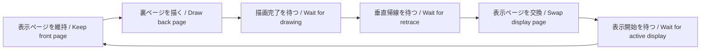

# SAToReinker-Over — 技術解説 / Technical notes

[READMEへ戻る / Back to README](README.md)

この文書は、公開中のMSX turbo R + V9990版の実装を説明します。画面はV9990のB1・256×212・4bpp（ビットマップ16色）です。検証はopenMSXで行っており、実機での速度や表示品質を保証するものではありません。

These notes describe the published MSX turbo R + V9990 implementation. It uses V9990 B1 mode at 256×212 with a 4bpp, 16-color bitmap. Validation uses openMSX; physical-hardware speed and display quality have not been verified.

## 1. 弾のチラつきを抑える仕組み / Keeping bullets steadily visible

### 弾画像をVRAM内でコピーする / Copying bullet images inside VRAM

起動時に4種類の丸い弾画像をVRAMの画面外領域へ作ります。プレイ中は各弾を7×7ドットの透明コピーで描きます。使用するのはV9990の`LMMM`コマンドです。CPUが弾を1ドットずつ塗ったり、毎回CPU側の画像データをVRAMへ送り直したりする必要を減らしています。

弾はハードウェアスプライトの表示枠を使わず、ビットマップの画素になります。このため、同じ走査線へ弾が集まった際にも、スプライトの横一列の表示枚数制限による欠けや、それを補うための交互表示を弾に持ち込まずに済みます。描画ループでは、管理中の生きている弾を毎回すべて描きます。

Four small round bullet images are built in off-screen VRAM during startup. Each live bullet is drawn with a 7×7 transparent `LMMM` copy. This reduces CPU-side pixel drawing and repeated transfers of image data from CPU memory into VRAM.

Bullets become bitmap pixels rather than consuming hardware sprite entries. Crowding them onto one scanline therefore does not invoke a sprite-per-line display limit or require alternating which bullets are shown. Every live bullet in the pool is drawn on each rendered game update.

実装 / Source: [game.c](game.c) — `main()`, `draw()`; [hardware.c](hardware.c) — `gfx_bullets_begin()`, `gfx_bullet()`.

### 完成した画面を切り替える / Displaying a completed frame

VRAM内に表示用と描画用の2ページを持ち、画像空間のY=0とY=256を交互に使います。1回の描画では、裏ページへ背景をコピーし、オーラ・得点・弾・レーザー・自機などを重ねます。背景も毎回戻すので、前の弾を消した跡や残像が残りにくい構成です。

`gfx_flip()`は次の順で動きます。

1. V9990のコマンド実行中フラグを確認し、描画完了を待つ。
2. 次の垂直帰線期間を待つ。
3. パレットと表示ページを更新する。
4. 表示期間が始まるまで待ち、旧表示ページを次の描画に使えるようにする。

表示中の画面へ背景を消してから描き直す途中経過を見せず、完成した画面単位で切り替える方式です。描画が重い場面では更新頻度が下がり得ますが、途中まで描いたページを先に表示する設計にはしていません。

Two pages occupy image-space Y=0 and Y=256. Each update copies the background into the back page and draws the aura, score, bullets, laser and player over it. Restoring the background also removes the previous bullet positions.

`gfx_flip()` waits for command completion, waits for a fresh vertical-retrace period, updates the palette and display page, and waits for active display before allowing the old front page to be reused. The visible image is replaced as a completed frame. Heavy scenes can reduce update frequency; the game does not deliberately expose an unfinished page to keep up.

実装 / Source: [game.c](game.c) — `draw()`; [hardware.c](hardware.c) — `gfx_wait()`, `gfx_vblank()`, `gfx_flip()`.

### 「192発」の意味 / What the 192-bullet figure means

通常弾の管理枠は192発です。枠が埋まると新しい弾の生成を見送ります。レーザーの軌跡は別管理です。ビットマップ化によってスプライト表示枚数の制約は避けられますが、CPUの演算、VDPへのコマンド発行、VRAM内コピーの時間は必要です。192発は全状況での一定速度や、無制限の弾数を意味しません。

There are 192 ordinary-bullet slots. New spawns are skipped when all slots are occupied; the laser trail is tracked separately. Bitmap rendering avoids sprite-count restrictions, but CPU simulation, command submission and VRAM copies still take time. The pool size is not a guarantee of a constant frame rate or unlimited bullets.

また、60Hzの画面出力、ゲームの更新回数、紹介GIFの25fpsは別の数値です。GIFのfpsをゲームの固定更新レートとして解釈しないでください。

The 60 Hz video output, game-update frequency and 25 fps GIF capture rate are different quantities. The GIF rate is not the game's fixed simulation rate.

## 2. R800とV9990の役割 / Dividing work between R800 and V9990

起動時に実行コードをRAMへコピーし、Turbo RのBIOSからR800 DRAMモードへ切り替えます。R800側は入力・弾の移動・当たり判定・得点を処理し、V9990側は画像コピーと線の描画を処理します。

弾の座標は1/16ドット単位の固定小数点です。回転する弾幕には64方向の速度テーブルを使い、プレイ中に浮動小数点の三角関数を計算する必要をなくしています。通常弾の移動と当たり判定の繰り返し部分はアセンブリで実装しています。

弾描画でも、コピーの幅・高さ・透明色処理など共通するレジスタ設定はまとめて行い、各弾での設定を減らします。ただし、コピー命令が内部で進める転送元Y座標は、毎回設定し直します。共通設定の使い回しだけで済むと考えると、転送元がずれる点に注意が必要です。

The startup code copies the runtime into RAM and selects R800 DRAM mode through the turbo R BIOS. The CPU handles input, movement, collision and scoring; the V9990 handles image copies and lines.

Bullet positions use fixed-point units of 1/16 pixel. A 64-direction velocity table replaces runtime floating-point trigonometry, and the ordinary-bullet movement/collision loop is written in assembly. Bullet rendering also reuses shared command settings such as dimensions and transparency. Source Y is explicitly restored for every copy because the command advances it internally.

実装 / Source: [boot.asm](boot.asm); [game.c](game.c) — `spawn()`, `advance_bullets()`, `vx[]`, `vy[]`; [hardware.c](hardware.c) — `gfx_bullet()`.

## 3. 地上絵とレーザーの演出 / Geoglyphs and the curved laser

地上絵は起動時に画面外の背景画像へ線で描きます。3つの絵に異なるパレット番号を割り当て、プレイ中に各色の明るさを変えて、絵がゆっくり入れ替わるように見せています。3枚の画像の半透明合成ではなく、1枚に描いた線の色を変える演出です。毎更新の裏ページへの背景コピーは必要ですが、線画そのものをCPUから送り直す必要はありません。

黄緑のレーザーは、先端が短時間だけ自機方向へ少しずつ曲がり、その通過位置を最大16点保持します。VDPの`LINE`コマンドで点を結び、明暗のある線にします。当たり判定もこの折れ線の各区間に沿って行うため、直線の判定だけが見えない場所に残る構成にはしていません。

The geoglyphs are drawn once into an off-screen background image using separate palette indices. Adjusting their colors makes the drawings fade in and out. This is palette animation of one bitmap, not alpha blending of three image layers. The background is still copied into the back page each update, but its line geometry does not need to be uploaded again.

The lime-green laser gradually turns toward the player during its initial homing period and retains up to 16 trail positions. V9990 `LINE` commands connect the points with light and dark strokes. Collision checks follow the segments of that same polyline.

実装 / Source: [hardware.c](hardware.c) — `background_init()`, `background_palette()`, `gfx_line()`; [game.c](game.c) — `step()`, `laser_contact()`, `draw()`.

## 4. 入力を記録するリプレイ / Replaying recorded input

保存しているのは動画ではなく、ゲーム更新ごとの入力です。上下左右と低速移動ボタンを1バイトにまとめ、現在は最大16384入力をRAMへ記録します。開始時の乱数種を固定し、弾の発射や難易度をゲーム内の`tick`で決めるため、同じルールと入力列からプレイを再計算できます。実時間の経過やVDP待ち時間を弾幕用の乱数種にしていません。

再生終了時には得点・終了理由・消費した入力数を照合します。ディスクファイルには形式番号、入力数、得点、終了理由、乱数種、入力列のチェックサムも含めます。チェックサムは破損検出用であり、改ざん防止やスコアの正当性を証明する仕組みではありません。

Replays store input, not video: one byte per game update encodes four directions and the focus button, with room for 16384 samples. A fixed initial random seed and tick-based pattern scheduling let the same rules and input sequence reconstruct a run. Wall-clock time and VDP waiting time do not seed the bullet-pattern RNG.

Playback checks the final score, outcome and consumed input count. The disk header includes the format, length, score, outcome, seed and an input checksum. That checksum detects corruption; it is not an anti-tampering or score-authentication mechanism.

実行速度に差があれば実時間での再生の長さは変わり得ます。互換性のために重要なのは、入力1回に対する演算と乱数の使用順を維持することです。現行の映像初期化更新では、既存の4432点・3670点の結果と再保存ファイルの一致を確認しています。詳しくは[検証記録](video-output-validation.txt)をご覧ください。

Different execution speeds can change wall-clock playback duration. Compatibility depends on preserving the simulation and RNG call order for each input step. Existing 4432- and 3670-point recordings and byte-identical re-saves were checked for the current output-initialization update; see the [validation record](video-output-validation.txt).

実装 / Source: [game.c](game.c) — `rnd()`, `reset_run()`, `step()`, `finish()`, `main()`; [disk.c](disk.c).

## 5. 音と実機向けの待ち処理 / Sound and hardware-aware waits

BGMはMSX-MUSICのリズム音源と反復低音、かすり音はPSGです。テンポ用のカウンタをゲーム更新ごとに進め、難易度に応じてリズムの間隔を変えます。FMレジスタの書き込みには待ち処理を入れています。

描画命令ではVDPの実行中フラグを確認し、Video9000の出力初期化では垂直帰線を利用した待機を入れています。CPUが高速だから待ちも削ってよい、という扱いにはしていません。各種ディスクインターフェースや実機での確認範囲は、[READMEの保存と検証の説明](README.md)を参照してください。

MSX-MUSIC supplies percussion and repeating bass; the PSG supplies graze sounds. A counter advanced on game updates changes rhythm spacing with difficulty. FM register writes include delay loops. Graphics commands wait on the VDP execution flag, and Video9000 output initialization waits on vertical retrace. Disk-interface and physical-hardware validation boundaries are documented in the [README](README.md).

実装 / Source: [game.c](game.c) — `fm()`, `music()`; [hardware.c](hardware.c) — `gfx_init()`, `gfx_wait()`.

VDPと出力制御の資料 / Hardware references: [Yamaha V9990 application manual](https://map.grauw.nl/resources/video/yamaha_v9990.pdf), [Sunrise Video9000 manual](https://map.grauw.nl/resources/video/v9manual.pdf).
