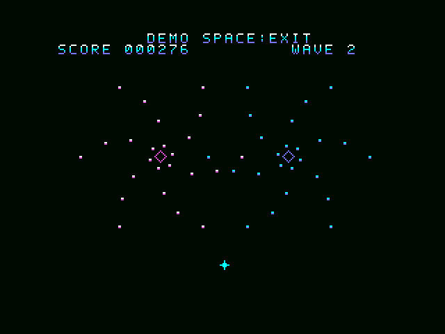
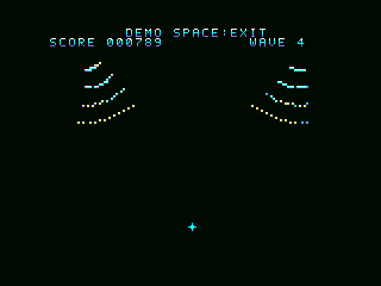

> **全37WAVEの拡張版 v0.2を追加しました。** [紹介・ダウンロード / Expanded Waves downloads](EXPANDED.md)  
> 既存6WAVE＋新31WAVE、RAM32KiB・512KiB ROM。以下は従来の6WAVE版 v0.1.1の説明とダウンロードです。  
> **37-wave expanded edition v0.2 is available.** This page retains the original six-wave v0.1.1 release.

# SAToReinker-Over MSX版 — 弾幕表現チャレンジ

**MSX1 PCG Bullet-Pattern Challenge · v0.1.1**

初代MSXのPCGで、美しい弾幕をどこまで動かせるか。
SAToReinker-Overの「避ける楽しさ」を題材にした、**弾幕表現チャレンジ**です。
Z80とTMS9918A、32KiBのメインRAMで動く、実際に遊べる実験版として公開します。

A playable **MSX1 bullet-pattern rendering challenge** based on SAToReinker-Over: exploring colourful, dense bullet
patterns with PCG on the Z80 and TMS9918A, using 32 KiB of main RAM.
This is an experimental MSX1 version. The [turbo R + V9990 version](../README.md) remains available separately.

## ダウンロード / Downloads

- [ROM・ソース・Windows起動セット / Complete bundle](SAToReinker-Over-MSX1-PCG-v0.1.1-bundle.zip?raw=true)
- [ROMのみ / ROM only](SAToReinker-Over-MSX1-PCG-v0.1.1.rom?raw=true)
- [ソース一式 / Source archive](SAToReinker-Over-MSX1-PCG-v0.1.1-source.zip?raw=true)
- [SHA-256](SHA256SUMS.txt)

**MSX1、RAM32KiB以上、VRAM16KiB、ASCII8マッパー、512KiB ROM。V9990は不要です。**
リプレイ・ディスクへの保存／読込はありません。V9990版のリプレイを再生する版ではありません。

Requires **MSX1, at least 32 KiB RAM, 16 KiB VRAM and a 512 KiB ASCII8 MegaROM**. No V9990 is required.
There is **no replay recording/playback or disk save/load**; V9990 replays are not supported by this version.

Windows起動セットはZIPを展開し、`play/START.cmd`を実行してください。openMSXは別途必要です。
既定位置は`C:\Program Files\openMSX\openmsx.exe`。別の場所なら環境変数`OPENMSX_EXE`で指定できます。
同梱設定は、openMSXに別途インストールされたC-BIOSを使う32KiB RAMの検証用MSX1構成です。
BIOS・エミュレータ・ディスクイメージは含みません。

Extract the bundle and run `play/START.cmd` with your own openMSX installation. Set `OPENMSX_EXE` if it is installed
elsewhere. The included test configuration uses externally installed C-BIOS and 32 KiB RAM; it is not a complete
model of a specific physical computer. No BIOS, emulator or disk image is bundled.

## 遊び方 / Controls

|操作 / Action|キーボード / Keyboard|Joystick port 1|
|---|---|---|
|移動 / Move|Arrows|Directions|
|開始・再挑戦 / Start or retry|SPACE|Trigger 1|
|低速移動 / Focus|SHIFT|Trigger 2|
|一時停止・再開 / Pause or resume|ESC|—|
|無敵の鑑賞デモ / Invincible viewing demo|タイトル／ゲームオーバーでD / D at title or game over|—|
|DEMO終了→タイトル / Leave demo|SPACE|Trigger 1|

DEMOは一時停止中でも終了できます。v0.1.1ではこの終了操作を追加し、画面にも`DEMO SPACE:EXIT`と表示します。
自機中心3×3ドットが当たり判定。かすりで加点と青い火花が出ます。火花に防御効果はありません。
６種類の弾幕を順に進み、その後は後半３種類を繰り返します。PSGのリズムと効果音があります。

The demo can also be exited while paused; v0.1.1 adds this control and the on-screen exit hint.
The player has a 3×3-pixel core hitbox. Grazing adds points and blue sparks; the sparks are not a shield.
Six patterns play in sequence, then the final three repeat. PSG provides the rhythm and effects.

## 実ROMの映像 / Actual ROM captures

openMSXでROMを動かした無音GIFです。**Dで選択する無敵の鑑賞DEMO**を撮影しており、人間が生き残ったプレイ記録ではありません。
DEMOは当たり判定を省くため、下記の通常プレイ性能測定とは区別しています。

Silent GIFs captured from the actual ROM in openMSX, using the keyboard-selected **invincible DEMO**.
These are not human survival runs. The demo skips collision checks; its speed is distinct from the normal-play measurement below.

### WAVE 2 — TWIN GALAXIES

### WAVE 4 — MIRROR WINGS

## PCGを弾幕に使う / Using PCG for bullets

弾は2×2ドット。弾道と重なりを開発時に計算し、768フレームの圧縮データとしてROMに用意しました。
MSXは次の配置とPCGを展開し、自機移動・当たり判定・得点・音をリアルタイムに処理します。
決められた弾幕を実際に避けるゲームで、プレイ動画の再生ではありません。自機を追う弾道はありません。

単発・２発の重なりには固定PCG辞書を使い、３発以上の重なりだけ動的PCGを転送します。
表示用の名前テーブルを表裏に分け、動的PCGも別番号にして、描画途中や書換中のパターンを見せない構成です。
弾にスプライトを使わないので、**横一列４枚のスプライト制限による弾の欠落を回避**できます。
SCREEN2の横８ドット単位の色制約はあるため、近接した弾が共通の色に変わる場合があります。

The ROM holds 768 compressed frames of precomputed trajectories and overlapping PCG patterns. Player movement, collision
detection, scoring and sound remain live. This is a playable fixed-pattern game, not a video or a general-purpose homing-bullet engine.
Fixed PCG dictionaries handle one or two dots per cell; only more crowded cells need dynamic patterns.
Two name tables and separate dynamic PCG indices keep incomplete frames off screen. Since bullets use PCG rather than
hardware sprites, they avoid the four-sprites-per-scanline limit. SCREEN2 colour sharing can change the colours of nearby dots.

ROMは正確に512KiB。起動・実行用の予約領域込みで176KiBを割り当て、336KiBは空いています。
ROMの空き容量と、Z80の処理速度・VDPへの転送量は別の制約です。

The ROM is exactly 512 KiB: 176 KiB allocated including reserved startup/runtime banks, with 336 KiB free.
ROM capacity and CPU/VDP transfer budgets are separate limits.

## 検証 / Validation

|項目 / Item|結果 / Result|
|---|---|
|最低構成 / Minimum configuration|openMSXの実メモリ量を32KiB RAM・16KiB VRAMに制限 / Physically limited emulator memory|
|通常プレイ高密度区間 / Dense normal-play sample|NTSC 28.5 updates/s、PAL 25.0 updates/s（各２秒 / two seconds each）|
|鑑賞DEMO / Viewing demo|NTSC 約30更新/秒 / about 30 updates/s|
|最大表示量 / Peak visible dots|309個の2×2ドット弾 / 309 dots of 2×2 pixels|
|復号・判定 / Decoder and collision|42条件・592回の実Z80判定が期待値と一致 / 42 scenarios and 592 native Z80 queries matched|
|VRAM転送 / VRAM access timing|確認した範囲で違反０ / zero violations in tested cases|
|再ビルド / Source rebuild|配布ソースから同一ROMを再生成 / byte-identical ROM from source archive|
|実機 / Physical hardware|未検証 / not tested|

通常プレイ測定はRAMへ場面と自機位置を設定した検証で、全場面の一定速度や生存実演を保証するものではありません。
The normal-play measurements use targeted scene/player state injection; they do not guarantee constant speed in every situation
or demonstrate survival to that point. All hardware-related results above are emulator observations.

[NTSC操作・撮影](ntsc-verification.json) · [PAL・通常プレイ測定](pal-verification.json) ·
[復号・当たり判定](native-decode-verification.json) · [PSG・起動設定](sound-launcher-verification.json) ·
[再ビルド](rebuild-verification.json)

ソースZIPを展開し、Python3・Pillow・Pasmoを用意して`python tools/build.py`でビルドできます。
`PASMO`環境変数でアセンブラのパスを指定できます。詳細と検証ツールはZIP内のREADMEとtoolsに含まれます。

Extract the source archive, install Python 3, Pillow and Pasmo, then run `python tools/build.py` from its project directory.
Set `PASMO` to your assembler path. The archive includes the full technical README and verification tools.

## 試作・免責 / Experimental status and disclaimer

本MSX版は**弾幕表現チャレンジの試作版**です。実機での動作は未検証であり、無保証で提供します。
動作・性能・互換性、今後の更新や不具合修正・個別対応を約束するものではありません。
ハードウェアメーカー等の公式作品・公認作品ではありません。

This MSX1 version is an **experimental bullet-pattern rendering challenge**, provided as-is without warranty.
Physical hardware has not been tested. Operation, performance, compatibility, continued development and individual bug fixes
are not promised. It is not an official product of or endorsed by any hardware manufacturer.
