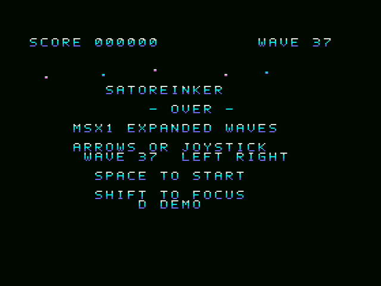

# SAToReinker-Over MSX版 — Stage Select

**v0.3 / 全37 WAVEから開始位置を選択 / MSX1 PCG弾幕表現チャレンジ**

全37WAVEの好きな面から遊べる、ステージセレクト付きの版です。
v0.2の弾幕データを保持し、タイトルとゲームオーバー画面で開始WAVEを選べるようにしました。
花状の放射、回転する三日月、蛇行するゲート、反射する扇、下からの噴水などを、
自分で避けて遊ぶことも、選んだWAVEから無敵のDEMOで眺めることもできます。

**初代MSX / RAM 32KiB / VRAM 16KiB / ASCII8 512KiB ROM。リプレイ機能はありません。**
v0.2の全37WAVEの弾幕データを保持しています。旧v0.2・v0.1.1とV9990版は別の成果物として維持します。

Version 0.3 adds **stage selection across all 37 waves** to the MSX1 PCG bullet-pattern challenge.
Play with a small hitbox and graze scoring, or watch the invincible DEMO. Requires 32 KiB RAM, 16 KiB VRAM
and a 512 KiB ASCII8 MegaROM. There is no replay or disk save/load. All 37 bullet sequences remain
byte-identical to v0.2. The previous releases and the Turbo R + V9990 edition remain separate.

## ダウンロード

- [ROM](SAToReinker-Over-MSX1-PCG-v0.3.rom?raw=true) / [起動バッチ・資料を含む一式ZIP](SAToReinker-Over-MSX1-PCG-v0.3-bundle.zip?raw=true)
- [ソースZIP](SAToReinker-Over-MSX1-PCG-v0.3-source.zip?raw=true) / [SHA-256一覧](SHA256SUMS-v0.3.txt)
- [ステージ選択・周回の検証](stage-select-verification.json) / [再ビルド一致確認](stage-select-rebuild-verification.json)

旧版は [v0.2 Expanded Waves](EXPANDED.md) と [v0.1.1](README.md) に保持しています。

## 起動と操作

WindowsでopenMSXをインストール済みなら、[v0.3一式ZIP](SAToReinker-Over-MSX1-PCG-v0.3-bundle.zip?raw=true) を展開し、`play/START.cmd` を実行してください。
標準以外の場所にある場合は環境変数 `OPENMSX_EXE` に実行ファイルの場所を指定できます。
同梱構成は、別途インストール済みのC-BIOSを使うRAM32KiB・VRAM16KiBの検証用MSX1構成です。
特定の実在機種を完全再現するものではありません。エミュレータとBIOSは同梱していません。

[ROM: SAToReinker-Over-MSX1-PCG-v0.3.rom](SAToReinker-Over-MSX1-PCG-v0.3.rom?raw=true)
を直接読み込む場合は、マッパーに **ASCII8** を指定してください。

|操作|キーボード|ジョイスティック1|
|---|---|---|
|開始WAVEの選択（タイトル／ゲームオーバー）|左右キー|左右入力|
|移動|カーソルキー|方向入力|
|選択WAVEから開始・再挑戦|SPACE|トリガー1|
|低速移動|SHIFT|トリガー2|
|一時停止・再開|ESC|—|
|選択WAVEから無敵の鑑賞デモ|タイトル／ゲームオーバーでD|—|
|デモを終了してタイトルへ|SPACE|トリガー1|

選択は01〜37を循環します。タイトル背景は選択中のWAVEだけを繰り返しプレビューします。
再挑戦時も、選択した開始WAVEを保持します。開始ボタンと左右を同時に押した場合は、表示中のWAVEで開始します。
デモは一時停止中でもSPACE／トリガー1で終了できます。自機の中心3×3ドットが当たり判定です。
周囲をかすると青い火花と加点が出ます。火花に防御効果はありません。

各WAVEを2回通過すると次へ進みます。**プレイ・DEMOともに37の後は01へ戻り、全37WAVEを循環します。**
選んだ開始位置にかかわらず、次のWAVEへ進むときや37から01へ戻るときもスコアを引き継ぎます。
これはゲームを強制終了するエンディングではありません。WAVEごとに密度と動きの緩急があります。
画面内の菱形は弾の発生源を示す目印で、接触判定はありません。新しい内部発生源も弾の発生前から表示します。
下から来るWAVE11／20／31には `FROM BELOW`、左右から来るWAVE27には `FROM SIDES` を
各パスの最初32更新だけHUDに表示し、進入方向を予告します。
PSGのベースと打楽器は従来の音を使い、後半は既存WAVE6の最高テンポを維持します。

English controls: LEFT/RIGHT at the title or game-over screen selects the starting wave, wrapping 01–37.
SPACE / trigger 1 starts or retries the selected wave; D starts its invincible DEMO. The selection is retained on retry.
The title background previews only the selected wave. Simultaneous start and direction input starts the displayed selection.
During play, arrows / joystick port 1 move, SHIFT / trigger 2 enables focus movement, and ESC pauses or resumes.
SPACE / trigger 1 exits DEMO even while paused. Each wave plays twice. Play and DEMO loop from wave 37 back to 01,
carrying the score across wave changes. All 37 waves remain in the loop, regardless of the chosen start.
This build has no forced ending. Emitter diamonds are warnings, not hazards. The visible cross has a 3×3-pixel core.

## 画面

ステージセレクト画面です。左右で選んだWAVEからプレイまたはDEMOを始められます。



以下のGIFは、既存の**v0.2実ROM**をopenMSXで動かした無敵の鑑賞DEMOです。
v0.3でも弾幕データは同一のため、弾幕の紹介として掲載しています。v0.3の新規撮影ではありません。

These GIFs show the existing **v0.2 ROM** running its invincible DEMO in openMSX.
The bullet data is unchanged in v0.3; these are pattern previews, not new v0.3 captures.


[WAVE19 MIRROR CASCADE — v0.2](https://github.com/kanon-ai/SAToReinker-Over/blob/main/msx1/wave-19-emulator.gif?raw=true) · [WAVE37 SILVER STREAM — v0.2](https://github.com/kanon-ai/SAToReinker-Over/blob/main/msx1/wave-37-emulator.gif?raw=true)

[全37 WAVEの資産一覧画像](stage-select-waves-contact.png)は、生成したPCGのオフラインプレビューです。
エミュレータ撮影や実機写真とは区別しています。

## 37 WAVE

|WAVE|名前|動き|
|---|---|---|
|01|LUNAR FAN|Seven turning fans open from the northern edge.|
|02|TWIN GALAXIES|Counter-rotating paired radial spirals.|
|03|SINE LOOM|Alternating cyan and magenta sine curtains.|
|04|MIRROR WINGS|Two wide fans weave through one another.|
|05|BRAIDED RIBBONS|Twelve narrow streams braid into four ribbons.|
|06|MANDALA OVER|Rotating radial rings and a crossing outer weave.|
|07|LOTUS BLOOM|Six petals unfurl as alternating open rings.|
|08|DRIFTING GATES|Broad moving openings guide a lateral dance.|
|09|CRESCENT MOON|Open crescents twist around a marked centre.|
|10|PRISM RICOCHET|A northern fan reflects into a zigzag prism.|
|11|RISING FOUNTAIN|Wide upward fans rise from below the playfield.|
|12|DOUBLE HELIX|Two bright helices weave through their shared axis.|
|13|SNAKE PASS|A narrow gate winds left and right in long waves.|
|14|BINARY CLOCK|Paired four-hand clocks trace expanding arcs.|
|15|KITE FESTIVAL|Paired wing-like fans sweep across the centre.|
|16|SUNFLOWER|Golden-angle pinwheels bloom into a broad corona.|
|17|IRIS GATES|Alternating gate openings travel across the screen.|
|18|LUNAR ECHO|Two successive crescent clusters chase one another.|
|19|MIRROR CASCADE|Bent side-reflected streams descend as a lattice.|
|20|REVERSE RAIN|Staggered rising waves demand a new direction of travel.|
|21|SILK RIBBONS|Four thin paired ribbons make a flowing silk curtain.|
|22|METEOR WEAVE|Two coloured meteor showers cross with broad gaps.|
|23|CLOVER CROWN|Four-lobed rings evolve into a turning clover crown.|
|24|ALTERNATE DOORS|Successive wide doors switch between left and right.|
|25|ORBITAL CLOCK|A six-hand spiral clock bends its rays in flight.|
|26|STAR ANEMONE|Eight-point flowers stretch into star-shaped rings.|
|27|TIDAL CROSS|Side-launched sine tides wash through one another.|
|28|WAVERING CORRIDOR|Three broad slalom walls leave a winding corridor.|
|29|ECLIPSE ARCS|Sparse sweeping arcs leave an off-centre escape path.|
|30|CRYSTAL RAIN|Reflected narrow fans draw long crystal diagonals.|
|31|SKY BLOSSOM|An upward fountain opens into two opposed bouquets.|
|32|QUANTUM BRAID|Two asymmetric helices separate and rejoin.|
|33|CHECKER COMETS|Checker-spaced diagonals sweep in opposite directions.|
|34|SERPENT RIVER|A rippling stream winds between banks of falling dots.|
|35|CELESTIAL GEARS|Two marked pinwheels turn like interlocking gears.|
|36|SPARSE CONSTELLATION|A gentle six-spoke constellation gives room to breathe.|
|37|SILVER STREAM|A sparse winding shower closes the programme softly.|

## 512KiBに収める仕組み

弾道を開発時に計算し、**4,736フレーム**のPCGと配置データをROMに格納しています。
本体はこのデータを復号し、自機移動・当たり判定・かすり・スコア・PSGをリアルタイムで処理します。
プレイ動画の再生ではありません。弾幕は固定の振り付けで、自機を追尾する軌道はありません。

- 弾は2×2ドット。8×8のPCGを16ビットの占有マスクで表します。
- 空白・単発・2個の重なりは固定辞書を使い、3個以上の重なりは動的PCGを転送します。
- 動的PCGは最大24種類／フレーム（上限32）。表示中と準備中で番号を分けます。
- 圧縮した名前テーブルを裏側に準備し、完成後に表示を切り替えます。
- 弾にはハードウェアスプライトを使わないため、横一列4枚の制限による弾の欠落はありません。
- 自機・かすり・発生源は合わせて同一走査線4枚以内です。
- 当たり判定は、その更新で表示するPCGの占有マスクを使います。

SCREEN2の横8ドットごとに2色という制約により、同じセルに集まる弾は共通の色になる場合があります。
重なった弾を消して処理量を減らす方式ではありません。

ROMは正確に524,288バイト。起動・実行用4バンクと、弾幕用60バンクを割り当てています。
実行コード・索引等の使用量は [ビルド記録](stage-select-build-manifest.json) に記録しています。
弾幕ストリームは491,520バイトで、最後のパケット後の余白は2,069バイトです。
追加候補42種類を評価し、11系統を含む31種類を採用しました。候補中の容量が小さい32種類を選んでも、
既存分と合わせたパケット本体だけでストリーム枠を超えるため、この候補群では追加31種類が最大です。
全ての理論的な圧縮法に対する最大値を意味するものではありません。

## 検証と回避可能性

**openMSX 21.0で検証。今回の拡張版を実機では検証していません。**

- 全4,736パケットの復号、表示される弾の保全、PCG上限、8KiBバンク境界を検証。
- 旧6WAVEの768パケットと索引先頭2,304バイトが旧版と完全一致。
- v0.2の全37WAVEのPCG・配置データを保持し、開始位置の選択と循環先だけを変更。
- タイトル／ゲームオーバーでの01〜37選択、両端の循環、選択WAVEでの開始・DEMO・再挑戦を検証。
- タイトルプレビューの固定、開始ボタン優先、37から01への遷移とスコア継続を検証。
- 自機の実際の1／3ドット移動・端での制限・3×3判定を用いて、37WAVEを各2回連続で通れる経路を探索。
- 仮に判定を5×5へ広げた場合も、全コースを通る経路が存在することをオフライン確認。
- 得られた9,472更新の経路を、タイトルから実ROMへキーボード入力だけで与え、全37WAVEを無被弾で通過。
  ゲームRAM／CPUレジスタ書き換えや無敵化は行わず、最後に通常プレイのままWAVE01へ循環することを確認。
- 全コースを同じ場所に停止したまま通れる座標は、探索した自機移動範囲にはありません。
- NTSC／PALのRAM32KiB・VRAM16KiB構成で、2桁表示、入力、デモ終了、停止・再開、発生源、後半バンクとPSGを確認。

経路探索は完全に先を知った機械操作です。**プレイヤーの反応時間や難易度を保証するものではありません。**
単純な移動で通れる区間も含めて緩急を付けています。全ての開始位置から救済可能という意味でもありません。
詳細・測定条件・最終ROMのSHA-256は `stage-select-*-verification.json` と [ビルド記録](stage-select-build-manifest.json) を参照してください。
実エミュレータの復号／当たり判定検証には、場面指定や一時的な判定用RAM配置を使う別の検査もあります。
これらは、RAMを書き換えない上記の全コース通過試験とは別に記録しています。

English validation: final-ROM keyboard-only playback of a precomputed route survived all 37 waves twice
(9,472 updates) with normal collision enabled. No gameplay RAM or CPU register modifications were used
in that run. Offline reachability also succeeds with a hypothetical 5×5 core. These are perfect-information
machine checks, not proof of difficulty for players or physical-hardware compatibility. Targeted decoder/collision
fixtures are separate tests and explicitly documented in their reports. Inspect the JSON reports for measured rates.

## ビルド

Python3、Pillow、Pasmoが必要です。`PASMO`でアセンブラのパスを指定できます。
標準は `C:/Software/Pasmo/pasmo.exe` です。エミュレータ検証には別途openMSXとC-BIOSが必要です。

```text
python tools/build.py
python tools/verify_stage_select.py
python tools/verify_routes.py
python tools/verify_planned_play.py
python tools/verify_and_capture.py
python tools/verify_pal.py
python tools/verify_native_decode.py
python tools/verify_sound_launcher.py
python tools/package.py
```

検証ごとに独立したエミュレータプロセスと作業ディレクトリを使い、利用者のBIOSや保存ディスクを配布物に含めません。
パッケージ作成時はソースZIPを別フォルダーへ展開して再ビルドし、ROMがバイト一致することを確認します。

## 免責事項

この版は弾幕表現を試す試作品です。**無保証であり、すべての実機・カートリッジ・エミュレータでの動作や、
今後の更新・不具合対応を約束するものではありません。** メーカー公式製品ではなく、メーカーによる承認を意味しません。

This is an experimental bullet-pattern rendering challenge, provided as-is without warranty.
Physical hardware has not been tested for this expanded build. Compatibility, future development and bug fixes
are not promised. It is not an official product of, or endorsed by, any hardware manufacturer.
