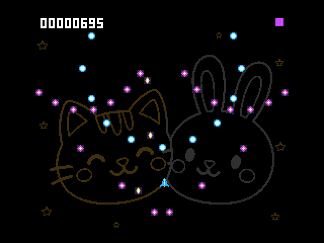
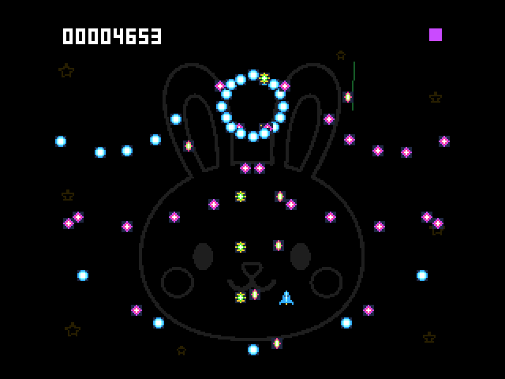

# SAToReinker-Over — V9968版

**MSX turbo R + V9968専用 / Requires MSX turbo R and V9968.**

16色のカラフルな弾幕を避け、かすりで得点を伸ばすゲームです。猫・兎・2匹の顔の線画背景、青いロケット、パステル調のタイトル、放物線状の緑レーザーを収録しています。背景はゆっくりとフェードしながら切り替わります。

- **[ゲームROMをダウンロード](SAToReinker-Over-V9968.rom)** — 512KiB、ASCII8
- [ソース](src/) / [ビルドスクリプト](tools/build.py) / [検証結果](validation/results.json)
- [SHA-256一覧](SHA256SUMS.txt)



## 宇宙船を守るシールド

障害物をかすめると、宇宙船を囲むシールドが光ります。必死に避けていた障害物も彗星も、実はゴムのように柔らかかったのです……。ぶつかっても、ぽよんと跳ね返るだけ。ねことうさぎの大事な宇宙船は無傷のまま、旅を続けます。

スコアへの挑戦が終わったら、SPACEで再挑戦、Xでリプレイを楽しめます。



## 動作環境・メモリ

処理速度とメモリ配置、R800/Z80切替を前提にした **turbo R専用版** です。通常のMSX1/MSX2/MSX2+用ではありません。V9990版とも別のROMです。

動作確認環境は **Panasonic FS-A1ST相当・本体RAM256KiB・V9968対応openMSX** です。V9968のEPAL・Sprite3を使用するため、標準のV9938/V9958や通常配布版openMSXのみでは動作しません。対応するエミュレータ構成は下記の起動例をご確認ください。

リプレイ用に16KiBのRAMを使用し、最大約5分28秒のプレイを記録できます。本体RAM256KiBは動作確認済みの構成です。

実機・FPGAでの動作や速度は未検証です。

## 操作

| 操作 | キー |
|---|---|
| 移動 | カーソル / ジョイスティック |
| 開始・低速移動 | SPACE / トリガー1 |
| リプレイ | X |
| ロード / セーブ | L / S（タイトル・結果画面） |

保存には書き込み可能なディスクをAドライブに用意してください。ファイル名は `SG256B.RPL`。他版と保存ディスクを分けてください。V9968版の初回公開版で保存したリプレイを引き続き利用できます。他機種版や公開前の試作版のリプレイには対応していません。

## 起動例

V9968対応の統合openMSXと、利用権のある本体BIOSを別途用意してください。BIOSとエミュレータは同梱していません。

```text
openmsx -machine Panasonic_FS-A1ST_V9968 -ext geo3d -cart SAToReinker-Over-V9968.rom -romtype ASCII8
```

保存する場合は、新規の空ディスクまたは専用ディスクを `-diska` で追加してください。

## ソースからビルド

Python 3、Z80用SDCC、Pasmoを用意します。リポジトリの `v9968` を作業ディレクトリとしてください。

```powershell
$env:SDCC = 'C:/path/to/sdcc.exe'
$env:PASMO = 'C:/path/to/pasmo.exe'
python tools/build.py
```

出力は `outputs/SAToReinker-Over-V9968.rom`。PATH上の `sdcc` / `pasmo` も使用できます。既に変換したゲーム用画像データを `assets/compiled/` に収録しているため、通常のビルドにPillowやフォントは不要です。

画像も再生成する場合のみPillowを用意して `python tools/assets.py` を実行します。タイトルはWindowsのComic Sans MS Boldを使用。別の環境では `TITLE_FONT` に利用可能なフォントを指定してください。フォント自体は同梱しません。フォント・Pillowの違いによって生成画像とROMのハッシュは変わります。背景線画は参考イラストをもとに生成した画像をゲーム用に加工しています。ライブラリ・開発ツールは各配布元のライセンスに従ってください。

## 動作確認

V9968対応openMSXで、プレイ、リプレイ、保存・ロード、再挑戦を確認しています。約175秒の自動プレイでは平均44.68fpsでした。描画速度は場面や実行環境によって変わります。

リプレイは初回公開版との互換性を確認しています。詳しい測定・照合結果は[検証記録](validation/results.json)と[リプレイ互換性の記録](validation/peace-replay.json)をご覧ください。

掲載GIFは、エミュレータ上の自動プレイを実時間・20fpsで収録したものです。
