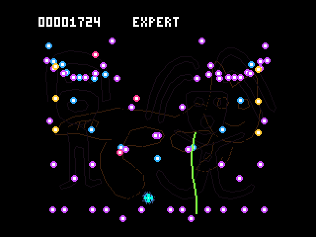
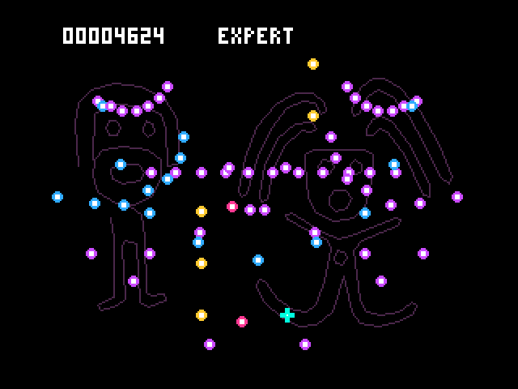
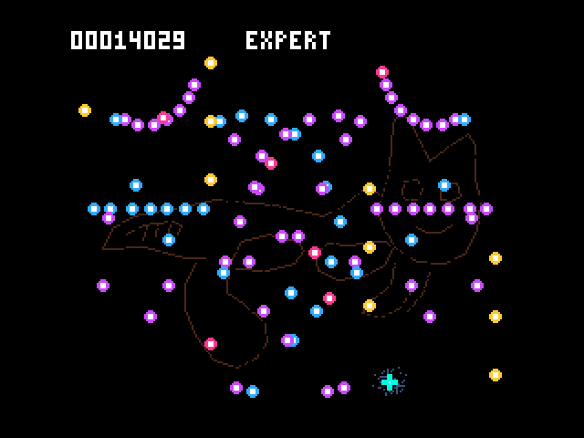

# SAToReinker-Over — V9990 Expert

**Turbo R + V9990 上級者向け試作版 / 512 KiB ASCII8 MegaROM**

さらに挑戦したいプレイヤーへ向けた、独立した上級者版です。
初代MSX拡張版の追加31パターン・11系統を、V9990用の動く弾として再構成しました。
元のV9990版の自機狙い弾・放射弾・扇形・二重らせん・交差弾・黄緑色の曲線レーザーを土台に、
花状の放射、三日月、反射する扇、下からの噴水、二重らせん、蛇行するゲートなどが重なります。
**WAVEをクリアして切り替える進行ではありません。** 元の弾幕が続く中へ新しい種別を加え、組み合わせで難しくします。

通常版のROM、初代MSX版、既存リプレイは別に保持します。両モードを同時にRAMへ載せる構成ではありません。

An independent expert prototype for **MSX turbo R + V9990**. It rearranges the 31 additional MSX1 waves
as additional procedural V9990 bullet layers over the original aimed shots, radial rings, mirrored fans, spirals, crossing shots and curved laser.
This is a continuous, increasingly combined barrage, not a sequence of separate waves.
The regular V9990 edition and the MSX1 editions remain separate.

## 起動 / Start

- [Windows試遊セット v0.1 / Play bundle](https://github.com/kanon-ai/SAToReinker-Over/raw/refs/heads/main/v9990-expert/outputs/SAToReinker-Over-V9990-Expert-v0.1-bundle.zip)
- [ソースZIP v0.1 / Source archive](https://github.com/kanon-ai/SAToReinker-Over/raw/refs/heads/main/v9990-expert/outputs/SAToReinker-Over-V9990-Expert-v0.1-source.zip)
- [チェックサム / SHA-256](https://github.com/kanon-ai/SAToReinker-Over/blob/main/v9990-expert/outputs/SHA256SUMS-expert.txt)

ZIPを新しいフォルダーへ展開し、`play/START.cmd` を実行してください。
別途openMSX、ユーザー所有のPanasonic FS-A1ST用システムROMが必要です。
標準以外の場所へインストールした場合は `OPENMSX_EXE` を設定してください。

- ROM: [SAToReinker-Over-EXPERT.rom](outputs/SAToReinker-Over-EXPERT.rom)
- マッパー: ASCII8 / 容量: 524,288バイト
- 検証の最低構成: Turbo R FS-A1ST・256 KiB RAM・V9990
- CPU: R800 DRAM高速モード
- 起動バッチ: Cart.1 GFX9000、Cart.2 ROM、A:に専用の保存ディスク

`play/EXPERT-SAVE.dsk` がない場合だけ、空ディスクから作成します。既存のファイルは上書きしません。
更新ZIPは別フォルダーへ展開し、必要なら自分の `EXPERT-SAVE.dsk` を移してください。
エミュレータ、BIOS、個人のリプレイは同梱しません。

Extract into a new folder and run `play/START.cmd`. Install openMSX separately and supply your own FS-A1ST system ROMs.
The launcher creates `EXPERT-SAVE.dsk` only when absent. Preserve that disk when updating.

## 操作とリプレイ / Controls and replay

|操作|キーボード|MSXジョイスティック1|
|---|---|---|
|移動|カーソルキー|方向入力|
|開始・再挑戦|SPACE|トリガー1|
|低速移動|SPACEを押しながら移動|トリガー1を押しながら移動|
|リプレイ再生|X|トリガー2|
|リプレイ中断|SPACE|トリガー1|
|保存|S|キーボードを使用|
|ロード|L|キーボードを使用|

Load / Save / Replay Viewはタイトルとゲームオーバー画面から選べます。
**メモリ上のリプレイは1件だけです。**

- 新しく遊ぶと、そのプレイの記録に置き換わります。メニューには `LAST PLAY` と表示します。
- 正常にロードすると、ロードした記録に置き換わります。`LOADED REPLAY` と表示します。
- Xは現在メモリにある記録を再生し、Sはその記録を保存します。
- リプレイを中断しても、現在の記録は残ります。

保存名は **`A:SATORIX.RPL`**、上級者版のルールIDは **3** です。
通常版の `SATORI2.RPL` とは別ファイルです。通常版のデータを改名してもロードを拒否します。
保存は同名ファイル1件を上書きします。入力列の容量は16,384更新で、上限到達時はCOMPLETEになります。

保存エラー時は中止し、DISK ERRORを表示してメニューへ戻ります。RAMの記録は保持します。
失敗した書き込みはファイルを元に戻す処理ではありません。DISK OKになった保存だけを使用してください。
不正ヘッダのロードは既存記録を保持しますが、読み込み途中のエラーやチェックサム不一致では記録が無効になります。

There is **one in-memory recording**. Starting a game replaces it with the latest play (`LAST PLAY`);
a successful load replaces it with the loaded recording (`LOADED REPLAY`). X replays that recording, S saves it,
and cancelling playback preserves it. The expert file is `A:SATORIX.RPL`, rule ID 3, limited to 16,384 input updates.
Regular-edition replays are rejected even if renamed. Save errors return to the menu while retaining the RAM recording;
interrupted disk overwrites are not transactional. A payload read/checksum failure invalidates the current recording.

## 難易度と表現

共通の通常弾速度係数を従来の1.1から1.3へ上げました。同じ基礎速度に対して約18％の増加です。
パターンごとの基礎速度は異なり、曲線レーザーの移動速度と自機の速度・当たり判定・得点規則は維持しています。
レベルは0から始まり、360更新ごとに上昇し、12で止まります（通常版は450更新ごと）。
元のV9990版と同じタイミング条件で弾幕種別が増え、元の攻撃は追加パターンの進行中も動き続けます。

追加種別は600更新から登場し、複数の追加モチーフを交代させて通常弾幕と組み合わせます。
追加モチーフの発射前には進入方向・発生源を予告します。これでゲーム全体が停止したり、全ての弾が消えたりはしません。
生成した弾は通常通り移動を続け、画面を出て消えます。かすりオーラは防御効果を持ちません。
背景の地上絵、MSX-MUSICのリズムBGMとPSG効果音を使用します。

上級プレイヤーによる難易度評価はまだ行っていません。
回避可能性は実際の移動量と当たり判定を用いた検査と、実ROMへのキーボード入力で確認しました。
機械が未来の軌道を知った経路は、プレイヤーの反応時間を保証するものではありません。

The common ordinary-bullet multiplier rises from 1.1 to 1.3 (about 18% for equal base velocities).
The original barrage remains active throughout. Additional motifs begin after 600 updates and overlap it;
transient warnings announce the new emission direction. There is no global wave break or bullet clear.
The difficulty has not yet been calibrated by expert players.

弾速の約18％増は「同じ基礎速度で、1更新あたり」の比較です。実時間の速度は描画負荷にも左右されます。
最終ROMの自動完走では平均約22.77更新/秒で、場面によりおよそ20〜30fpsです。
同じ弾数・配置を使った描画だけの比較では通常版と同等でした。
追加弾の走査を省力化し、弾道を変えずに最適化前の平均約21.92から改善しました。

The 18% figure describes displacement per update, not a frame-rate increase. The verified full run averaged
22.77 updates/second, with scene rates around 20–30 fps. Rendering equivalent scenes costs the same as the regular edition.
Skipping unnecessary supplementary-motion checks improved the expert run from 21.92 updates/second without changing trajectories.

## 実ROMの画面 / Emulator captures

下記はopenMSXで実ROMを動かして撮影した画面です。自動操作による回避で、GIFの速度はエミュレータ内の経過時間に合わせています。

|序盤の組み合わせ|中盤|高難度の組み合わせ|
|---|---|---|
||||

These are native-ROM emulator captures with automated keyboard input. GIF timing follows emulated time.

## 容量・メモリ・決定性

弾道は整数と固定テーブルで計算します。初代MSX版のPCGフレームをそのまま移す方式ではありません。
弾は最大192個。V9990の透明色付きコピーで裏画面に描き、完成した画面を垂直帰線で切り替えます。
弾のハードウェアスプライト枚数制限による交互表示はありません。一定のfpsを保証する意味ではありません。

起動専用のオーラと地上絵座標をROMに置き、初期化時にVRAMへ転送します。
実行コード領域は8000h〜C7FFh、変数はC800hから、スタックはD800hから下向きです。
ディスク処理用の高位RAMを上書きしない配置です。入力記録には4000h〜7FFFhの1枠を使用します。
起動時のV9990/Video9000映像出力初期化と、従来のディスクエラー復帰処理を保持しています。

プレイとリプレイは同じ更新処理を使用し、初期状態をリセットして入力列から再現します。
パターン、発射時期、レーザーの旋回、スコアは壁時計や描画待ち時間を乱数として使いません。
上級者版のルールを将来変更するときは、リプレイ互換性を再確認する必要があります。

## ビルドと検証 / Build and validation

Python 3、Z80対応SDCC、Pasmoを用意して `python tools/build.py` を実行してください。
PATH上にない場合は `SDCC` と `PASMO` に実行ファイルのパスを設定します。
検証ツールにはopenMSXとユーザー所有BIOS、Pillow、NumPy、ホスト用GCC/Clangを使うものがあります。
通常版との比較検査には、別フォルダーに保持した通常版が必要です。

最終ROMのSHA-256、実行メモリ範囲、検証の条件と結果は `outputs/*verification.json` と
`outputs/build-manifest.json` を参照してください。ソースZIPからの再ビルド一致も確認して配布します。

- FS-A1ST相当の256 KiB RAM、R800 DRAMモードで起動。GFX9000とVideo9000の映像出力初期化を確認。
- 既存の弾幕・追加31種・追尾レーザーを動かしたまま、16,384更新を通常のキー入力で完走。23,109点でCOMPLETE。
- この経路では無敵化・ゲームRAM変更を使わず、同時弾数は最大125個、生成失敗は0件。
- 保存・ロード・再生一致・再生中断・記録の置換と、ディスク異常からの復帰など11ケースを確認。
- 全長の検証用入力をディスクからロードして再生し、16,384更新後のスコア・かすり・自機・レーザーの状態が元プレイと一致。再保存した入力データもバイト単位で一致。
- 通常版のROMとソース、初代MSX版のROMを保持。起動時に転送する背景・オーラ・タイトル・弾画像の一致を確認。

自動経路は回避可能な入力列が存在することの確認です。どの位置・どの操作からでも回避できるという保証や、
プレイヤーにとっての難易度評価ではありません。ジョイスティック入力はエミュレータのポート値を使った検査で、実物のパッドは未検証です。

The final ROM completed all 16,384 updates with ordinary keyboard input, including every supplementary motif,
the original barrage and homing lasers: 23,109 points, peak 125 live bullets, zero allocation drops.
No invincibility or game-RAM changes were used for this run. This proves a successful route exists;
it does not establish the difficulty for players or safety from every possible position.
Eleven replay/disk scenarios passed, including playback matching and error recovery. A full-length disk-loaded replay also matched
the original run's final state and produced identical replay bytes when saved again. Physical hardware remains untested.

自動経路を再生成して実ROMで確かめる場合は、ビルド後に以下を使用できます。実ROMを通す前のホスト計算だけでは検証完了になりません。

```text
python tools/plan_native_route.py
python tools/verify_runtime.py --inputs work/host-controller/planned-inputs.bin --capture
python tools/verify_long_replay.py
```

`plan_native_route.py` はホスト用GCC/Clangを使います。PATH上にない場合は `CC` を設定してください。
通常版を比較対象とする検査と `package.py` は、開発用の通常版・検証記録を別途必要とします。

## 免責事項 / Disclaimer

本作は非公式の実験的な上級者版です。**無保証で提供し、実機動作・全環境での互換性・保存データの保全・
今後の更新や個別の不具合対応を約束しません。実機では未検証です。**
検証用の自動操作、エミュレータ撮影、プレイヤーのプレイ、実機結果は区別して記載します。

This experimental, unofficial expert edition is provided as-is without warranty. Physical hardware has not been tested.
Compatibility, data preservation, future updates and individual bug fixes are not promised.
